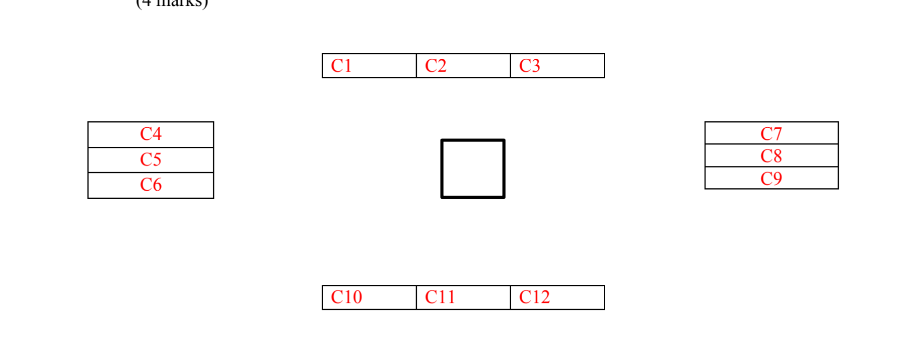

# Report description:
Project name and team members
Brief description about what you have done in each item:
1) Data preparation (training and testing sets) and preprocessing used.
2) Feature extraction methods used.
3) Classifier used and its parameters.
4) Classification results (comparisons) in table form.
5) Screen shots for your running interface.
Don’t put any Code samples in the report, just brief description in the form of text,
diagrams, tables, or flowcharts.

## Idea 2: EOG based Calculator.
   A human computer interface based on EOG is needed with the following requirements:
1) Teaching Assistants will give you the data.
2) Use suitable EOG preprocessing.
3) Compare using raw samples and wavelets coefficients for EOG band for feature extraction.
4) Choose one classifier and test different parameters for it to get the best results for each class.
5) Compare the different features according to the achieved accuracy by the classifier.
6) The UI can be a very simple calculator for numbers of only one digit. 
The calculator
    interface should include digits from 0 to 9, operations (+, -, x and /), C (clear) and E (exist).
    The user should choose a digit, then operation, and finally the second digit. User choices
    should be written in screen (ex: text box) and result should appear just after choosing the
    second digit automatically. All buttons in the interface should arranged in such a way that
    only two movements are enough for each choice besides a blinking for selection.

    